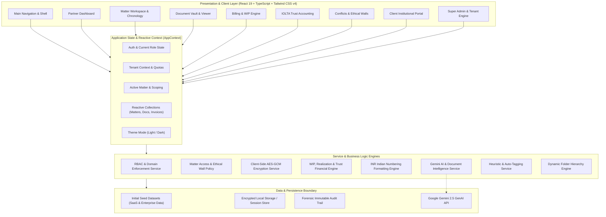
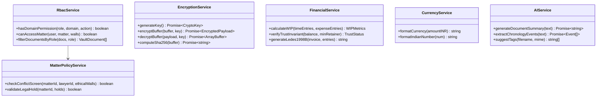

# System Architecture

Counsel Repos is architected as an enterprise multi-tenant legal practice management platform. It combines strict zero-trust role-based access control, cryptographic anti-spoliation document vaults, trust accounting safeguards, and a dynamic SaaS license engine.

---

## 1. High-Level Architecture Diagram

---

## 2. Architectural Layers

### 2.1 Presentation Layer (Frontend Shell)

- **Framework**: React 19 with functional components and hooks (`useState`, `useCallback`, `useMemo`, `useContext`).
- **Styling**: Tailwind CSS v4 integrated via `@tailwindcss/vite` with dark/light mode theming support.
- **Icons & Motion**: Lucide React iconography and Motion (`motion/react`) for smooth micro-interactions.
- **Modularity**: Divided into distinct functional modules:
  - `src/components/navigation/`: App Header, Navigation Sidebar, Role Switcher, Tenant Switcher.
  - `src/components/dashboard/`: Firm Financial Overview, WIP Counters, Matter Velocity, Recent Activity.
  - `src/components/matters/`: Matter Detail, Task Management, Litigation Chronology, Legal Holds.
  - `src/components/vault/`: Multi-folder Document Vault, PDF preview, Version History, Hash Integrity Verification.
  - `src/components/billing/`: WIP Ledger, Time/Expense Entry Modals, LEDES-1998B Invoicing Engine.
  - `src/components/trust/`: IOLTA Ledger, Evergreen Retainer Deficit Tracker, 3-Way Reconciliation.
  - `src/components/conflicts/`: ABA Model Rule 1.10 Ethical Wall screener, Disqualification manager.
  - `src/components/portal/`: External Institutional Client View, Secure Document Share, Invoice Review.
  - `src/components/admin/`: Super Admin SaaS License Manager, Tenant Quota Control, User RBAC Matrix.

---

### 2.2 Application State & Reactive Context (`AppContext`)

The application utilizes a centralized reactive provider (`AppContext.tsx`) managing:

- **Tenant Context**: Current tenant identifier (`ten-1`, `ten-2`, etc.), license tier, seat quotas, and storage utilization.
- **Current User & Role**: Active user object and simulated active role (`Administrator`, `Lawyer`, `Paralegal`, `Client`).
- **Domain Collections**: In-memory state synchronized with reactive setters for Matters, Invoices, Time Entries, Trust Transactions, Ethical Walls, Legal Holds, and Documents.
- **SaaS Plan Catalog**: Dynamic `licensePlans` array with runtime tier configuration methods (`updateLicensePlan`, `addLicensePlan`).
- **Theme State**: Dark/Light mode toggle synchronized with `localStorage`.

---

### 2.3 Service Layer & Domain Policy Engine

---

## 3. Security & Multi-Tenancy Architecture

### 3.1 Multi-Tenant Isolation

1. **Logical Partitioning**: Every record (`Matter`, `VaultDocument`, `Invoice`, `TrustAccount`, `User`) is scoped by `tenantId`.
2. **Quota Enforcement**:
   - **Seat Quotas**: Monitored on user creation and role assignments (`seatsAllocated <= maxSeats`).
   - **Storage Vault Quota**: Monitored before document uploads (`storageUsedGB + newFileSizeGB <= storageLimitGB`).
3. **Super Admin Boundary**: Super Admins operate at the SaaS infrastructure level to manage subscriptions and tenant lifecycle, isolated from client confidential legal files.

---

### 3.2 Role-Based Access Control (RBAC) Matrix

The system enforces 4 hierarchical roles across 7 functional security domains:

| Role | Matters | Documents | Billing | Trust / IOLTA | Conflicts / Walls | Audit Trail | System / SaaS |
| :--- | :---: | :---: | :---: | :---: | :---: | :---: | :---: |
| **Administrator** | Full | Full | Full | Full | Full | View Only | Full |
| **Lawyer** | Read/Write | Read/Write | Log Time/Exp | View Balance | View Walls | View Own | None |
| **Paralegal** | Assigned | Upload/Read | Log Time | None | None | None | None |
| **Client** | Portal Only | Shared Only | Pay Invoices | View Retainer | None | None | None |

---

### 3.3 Legal Hold & Tamper-Proof Cryptographic Vault

- Every document uploaded computes a **SHA-256 tamper-proof hash**.
- When a matter is placed under an active **Legal Hold**, documents are locked in read-only preservation mode.
- Deletion or destructive edits are strictly blocked by the system until a dual-authorization release request is approved by a secondary partner.
