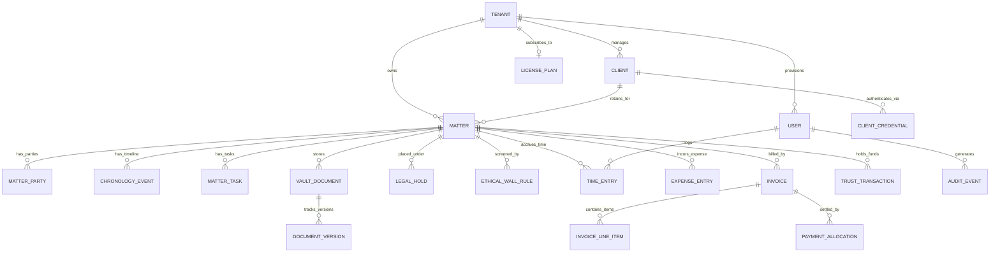

# Database Schema & Entity Relationships

This document details the relational and document data model for **Counsel Repos**, including entity relationships, field definitions, data types, constraints, foreign keys, and indexing recommendations.

---

## 1. Entity-Relationship Diagram (ERD)

---

## 2. Entity Specifications

### 2.1 Multi-Tenant & SaaS Licensing

#### Table: `tenants`

Stores subscriber law firms, enterprise legal departments, and quotas.

| Column | Type | Constraints | Description |
| :--- | :--- | :--- | :--- |
| `id` | `VARCHAR(36)` | `PRIMARY KEY` | Unique tenant ID (e.g., `ten-1`) |
| `name` | `VARCHAR(255)` | `NOT NULL` | Law firm legal corporate name |
| `domain` | `VARCHAR(100)` | `NOT NULL, UNIQUE` | Dedicated tenant hostname/domain |
| `status` | `VARCHAR(20)` | `NOT NULL` | Enum: `ACTIVE`, `TRIAL`, `SUSPENDED`, `PAST_DUE` |
| `plan` | `VARCHAR(20)` | `NOT NULL` | Foreign key reference to `license_plans.tier` |
| `license_key` | `VARCHAR(64)` | `NOT NULL, UNIQUE` | Cryptographic license identifier |
| `seats_allocated` | `INT` | `NOT NULL, DEFAULT 1` | Count of active provisioned user seats |
| `max_seats` | `INT` | `NOT NULL` | Contracted max user seat quota |
| `storage_used_gb` | `FLOAT` | `NOT NULL, DEFAULT 0` | Current encrypted document storage in GB |
| `storage_limit_gb` | `INT` | `NOT NULL` | Contracted storage limit quota in GB |
| `monthly_price_inr` | `DECIMAL(12,2)` | `NOT NULL` | Monthly subscription fee in Indian Rupees (₹) |
| `renew_date` | `DATE` | `NOT NULL` | Next contract renewal cutoff date |
| `admin_email` | `VARCHAR(255)` | `NOT NULL` | Law firm administrator contact email |
| `features` | `JSONB` | `NOT NULL` | Feature toggle flags (AI, IOLTA, Holds) |
| `created_at` | `TIMESTAMP` | `NOT NULL` | Tenant creation timestamp |

#### Table: `license_plans`

Dynamic SaaS subscription tiers and default entitlements.

| Column | Type | Constraints | Description |
| :--- | :--- | :--- | :--- |
| `tier` | `VARCHAR(20)` | `PRIMARY KEY` | Enum: `STARTER`, `PROFESSIONAL`, `ENTERPRISE`, `SOVEREIGN` |
| `name` | `VARCHAR(100)` | `NOT NULL` | Display tier name |
| `monthly_price_inr` | `DECIMAL(12,2)` | `NOT NULL` | Base monthly fee (₹ INR) |
| `annual_price_inr` | `DECIMAL(12,2)` | `NOT NULL` | Annual fee = $12 \times \text{monthly\_price\_inr}$ |
| `max_seats_included` | `INT` | `NOT NULL` | Base bundled user seats |
| `storage_gb` | `INT` | `NOT NULL` | Base bundled vault storage in GB |
| `description` | `TEXT` | `NOT NULL` | Tier description & value proposition |
| `popular` | `BOOLEAN` | `DEFAULT FALSE` | Highlight badge flag |

---

### 2.2 Users & Identity

#### Table: `users`

Firm personnel, associates, partners, and administrators.

| Column | Type | Constraints | Description |
| :--- | :--- | :--- | :--- |
| `id` | `VARCHAR(36)` | `PRIMARY KEY` | Unique user identifier (e.g., `usr-1`) |
| `tenant_id` | `VARCHAR(36)` | `NOT NULL, FK -> tenants(id)` | Tenant partition boundary |
| `name` | `VARCHAR(255)` | `NOT NULL` | Full legal name |
| `email` | `VARCHAR(255)` | `NOT NULL, UNIQUE` | Corporate email address |
| `role` | `VARCHAR(30)` | `NOT NULL` | Standard role: `Administrator`, `Lawyer`, `Paralegal`, `Client` |
| `billing_rate` | `DECIMAL(10,2)` | `NOT NULL, DEFAULT 0` | Standard hourly billable rate (₹ INR) |
| `bar_number` | `VARCHAR(50)` | `NULLABLE` | State Bar licensing number |
| `department` | `VARCHAR(100)` | `NOT NULL` | Practice group or department |
| `avatar_url` | `TEXT` | `NULLABLE` | Profile picture URI |
| `is_active` | `BOOLEAN` | `DEFAULT TRUE` | Account active state |

#### Table: `clients`

Corporate, governmental, or individual clients.

| Column | Type | Constraints | Description |
| :--- | :--- | :--- | :--- |
| `id` | `VARCHAR(36)` | `PRIMARY KEY` | Client ID (e.g., `cli-1`) |
| `tenant_id` | `VARCHAR(36)` | `NOT NULL, FK -> tenants(id)` | Scoped tenant identifier |
| `name` | `VARCHAR(255)` | `NOT NULL` | Institutional corporate name |
| `primary_contact_name` | `VARCHAR(255)` | `NOT NULL` | Primary liaison contact |
| `primary_contact_email` | `VARCHAR(255)` | `NOT NULL` | Contact email |
| `phone` | `VARCHAR(50)` | `NOT NULL` | Contact phone |
| `address` | `TEXT` | `NOT NULL` | Registered business address |
| `industry` | `VARCHAR(100)` | `NOT NULL` | Sector (e.g., Banking, Healthcare, Tech) |
| `portal_enabled` | `BOOLEAN` | `DEFAULT TRUE` | Client portal access authorization |

---

### 2.3 Legal Matters & Case Workspaces

#### Table: `matters`

Central legal case or transaction workspace.

| Column | Type | Constraints | Description |
| :--- | :--- | :--- | :--- |
| `id` | `VARCHAR(36)` | `PRIMARY KEY` | Unique matter ID (e.g., `mat-1`) |
| `tenant_id` | `VARCHAR(36)` | `NOT NULL, FK -> tenants(id)` | Scoped tenant identifier |
| `matter_number` | `VARCHAR(50)` | `NOT NULL, UNIQUE` | Firm case docket code (e.g., `MAT-2024-001`) |
| `title` | `VARCHAR(255)` | `NOT NULL` | Case or transaction caption |
| `client_id` | `VARCHAR(36)` | `NOT NULL, FK -> clients(id)` | Retaining client |
| `status` | `VARCHAR(20)` | `NOT NULL` | `INTAKE`, `ACTIVE`, `CLOSED`, `ARCHIVED` |
| `practice_area` | `VARCHAR(100)` | `NOT NULL` | E.g., Commercial Litigation, IP, M&A |
| `lead_partner_id` | `VARCHAR(36)` | `NOT NULL, FK -> users(id)` | Responsible partner |
| `assigned_user_ids` | `JSONB / ARRAY` | `NOT NULL` | Array of authorized matter team members |
| `fee_arrangement` | `VARCHAR(50)` | `NOT NULL` | Hourly, Capped, Fixed Fee, Contingency |
| `budget_cap` | `DECIMAL(12,2)` | `NULLABLE` | Total fees budget cap |
| `evergreen_trust_minimum` | `DECIMAL(12,2)` | `NOT NULL, DEFAULT 0` | Minimum required IOLTA retainer (₹ INR) |
| `has_active_hold` | `BOOLEAN` | `DEFAULT FALSE` | Anti-spoliation lock flag |

#### Table: `matter_parties`

Opposing parties, co-counsels, judges, and key witnesses.

| Column | Type | Constraints | Description |
| :--- | :--- | :--- | :--- |
| `id` | `VARCHAR(36)` | `PRIMARY KEY` | Party identifier |
| `matter_id` | `VARCHAR(36)` | `NOT NULL, FK -> matters(id)` | Associated matter |
| `name` | `VARCHAR(255)` | `NOT NULL` | Party individual or corporate name |
| `role` | `VARCHAR(50)` | `NOT NULL` | Client, Opposing Party, Co-Counsel, Judge, Witness |
| `conflict_status` | `VARCHAR(20)` | `NOT NULL` | `CLEARED`, `FLAGGED`, `RESOLVED` |

---

### 2.4 Document Vault & Legal Holds

#### Table: `vault_documents`

Cryptographically secured case files.

| Column | Type | Constraints | Description |
| :--- | :--- | :--- | :--- |
| `id` | `VARCHAR(36)` | `PRIMARY KEY` | Unique document ID |
| `matter_id` | `VARCHAR(36)` | `NOT NULL, FK -> matters(id)` | Matter partition |
| `folder` | `VARCHAR(100)` | `NOT NULL` | Folder category (Pleadings, Discovery, etc.) |
| `title` | `VARCHAR(255)` | `NOT NULL` | Document title |
| `file_name` | `VARCHAR(255)` | `NOT NULL` | Physical filename |
| `file_type` | `VARCHAR(10)` | `NOT NULL` | `pdf`, `docx`, `xlsx`, `txt` |
| `file_size` | `VARCHAR(20)` | `NOT NULL` | Display size string (e.g., `4.2 MB`) |
| `is_held` | `BOOLEAN` | `DEFAULT FALSE` | True if subject to active Legal Hold |
| `legal_hold_id` | `VARCHAR(36)` | `NULLABLE, FK -> legal_holds(id)` | Active hold reference |
| `tags` | `TEXT[]` | `NOT NULL` | Legal classification tags |
| `confidentiality_level` | `VARCHAR(50)` | `NOT NULL` | Public, Firm Confidential, Attorneys Eyes Only |
| `created_by` | `VARCHAR(36)` | `NOT NULL, FK -> users(id)` | Uploading user ID |
| `created_at` | `TIMESTAMP` | `NOT NULL` | Document creation timestamp |

#### Table: `legal_holds`

Anti-spoliation litigation preservation holds.

| Column | Type | Constraints | Description |
| :--- | :--- | :--- | :--- |
| `id` | `VARCHAR(36)` | `PRIMARY KEY` | Hold ID (e.g., `LH-001`) |
| `matter_id` | `VARCHAR(36)` | `NOT NULL, FK -> matters(id)` | Targeted matter |
| `hold_title` | `VARCHAR(255)` | `NOT NULL` | Preservation order title |
| `status` | `VARCHAR(20)` | `NOT NULL` | `ACTIVE`, `PENDING_RELEASE`, `RELEASED` |
| `scope_description` | `TEXT` | `NOT NULL` | Scope and custodian guidance |
| `custodians` | `TEXT[]` | `NOT NULL` | Array of custodian names/emails |
| `first_approver_id` | `VARCHAR(36)` | `NOT NULL, FK -> users(id)` | Issuing partner ID |
| `second_approver_id` | `VARCHAR(36)` | `NULLABLE, FK -> users(id)` | Dual-control second partner ID |
| `release_justification` | `TEXT` | `NULLABLE` | Formal rationale for hold release |
| `tamper_proof_hash` | `VARCHAR(64)` | `NOT NULL` | Cryptographic SHA-256 hash of order |

---

### 2.5 Financials, Trust Accounting & LEDES Invoicing

#### Table: `time_entries`

Unbilled and billed billable work.

| Column | Type | Constraints | Description |
| :--- | :--- | :--- | :--- |
| `id` | `VARCHAR(36)` | `PRIMARY KEY` | Time entry ID |
| `matter_id` | `VARCHAR(36)` | `NOT NULL, FK -> matters(id)` | Associated matter |
| `user_id` | `VARCHAR(36)` | `NOT NULL, FK -> users(id)` | Timekeeper ID |
| `date` | `DATE` | `NOT NULL` | Service delivery date |
| `hours` | `DECIMAL(4,2)` | `NOT NULL` | Duration in decimal hours |
| `rate` | `DECIMAL(10,2)` | `NOT NULL` | Hourly rate applied (₹ INR) |
| `total` | `DECIMAL(12,2)` | `NOT NULL` | Computed fee: `hours * rate` |
| `utbms_code` | `VARCHAR(20)` | `NOT NULL` | UTBMS Activity code (e.g., `A103`) |
| `narrative` | `TEXT` | `NOT NULL` | Detailed description of legal services |
| `status` | `VARCHAR(20)` | `NOT NULL` | `WIP`, `REVIEW`, `APPROVED`, `INVOICED` |
| `invoice_id` | `VARCHAR(36)` | `NULLABLE, FK -> invoices(id)` | Billed invoice reference |

#### Table: `trust_transactions`

IOLTA trust ledger transactions.

| Column | Type | Constraints | Description |
| :--- | :--- | :--- | :--- |
| `id` | `VARCHAR(36)` | `PRIMARY KEY` | Trust transaction ID |
| `matter_id` | `VARCHAR(36)` | `NOT NULL, FK -> matters(id)` | Dedicated matter trust account |
| `date` | `DATE` | `NOT NULL` | Transaction execution date |
| `type` | `VARCHAR(30)` | `NOT NULL` | `RETAINER_DEPOSIT`, `TRUST_APPLIED_TO_INVOICE`, `DISBURSEMENT` |
| `amount` | `DECIMAL(12,2)` | `NOT NULL` | Credit (positive) or Debit (negative) in ₹ INR |
| `running_balance` | `DECIMAL(12,2)` | `NOT NULL` | Balance after transaction application |
| `authorized_by` | `VARCHAR(255)` | `NOT NULL` | Partner authorizing trust movement |
| `related_invoice_id` | `VARCHAR(36)` | `NULLABLE, FK -> invoices(id)` | Associated invoice reference |

#### Table: `invoices`

Formal fee and disbursement bills with LEDES-1998B format support.

| Column | Type | Constraints | Description |
| :--- | :--- | :--- | :--- |
| `id` | `VARCHAR(36)` | `PRIMARY KEY` | Invoice identifier |
| `invoice_number` | `VARCHAR(50)` | `NOT NULL, UNIQUE` | Formal invoice code (e.g., `INV-2024-001`) |
| `matter_id` | `VARCHAR(36)` | `NOT NULL, FK -> matters(id)` | Exactly one matter per invoice |
| `client_id` | `VARCHAR(36)` | `NOT NULL, FK -> clients(id)` | Billed client |
| `issued_date` | `DATE` | `NOT NULL` | Billing date |
| `due_date` | `DATE` | `NOT NULL` | Payment due date |
| `subtotal_time` | `DECIMAL(12,2)` | `NOT NULL` | Subtotal professional fees (₹ INR) |
| `subtotal_expenses` | `DECIMAL(12,2)` | `NOT NULL` | Subtotal case disbursements (₹ INR) |
| `total_amount` | `DECIMAL(12,2)` | `NOT NULL` | Total invoice payable (₹ INR) |
| `amount_paid` | `DECIMAL(12,2)` | `NOT NULL, DEFAULT 0` | Cumulative settled funds |
| `balance_due` | `DECIMAL(12,2)` | `NOT NULL` | Outstanding balance |
| `status` | `VARCHAR(20)` | `NOT NULL` | `DRAFT`, `ISSUED`, `PART_PAID`, `PAID` |
| `ledes_format_string` | `TEXT` | `NULLABLE` | Generated ASCII LEDES-1998B payload |

---

### 2.6 Forensic Audit Trail

#### Table: `audit_events`

Append-only immutable security ledger.

| Column | Type | Constraints | Description |
| :--- | :--- | :--- | :--- |
| `id` | `VARCHAR(36)` | `PRIMARY KEY` | Audit record ID |
| `timestamp` | `TIMESTAMP` | `NOT NULL` | UTC ISO-8601 timestamp |
| `user_id` | `VARCHAR(36)` | `NOT NULL` | Actor user identifier |
| `user_name` | `VARCHAR(255)` | `NOT NULL` | Actor display name |
| `user_role` | `VARCHAR(30)` | `NOT NULL` | Actor active role |
| `matter_id` | `VARCHAR(36)` | `NULLABLE` | Matter context if applicable |
| `action` | `VARCHAR(50)` | `NOT NULL` | E.g., `DOCUMENT_UPLOADED`, `LEGAL_HOLD_CREATED` |
| `entity_type` | `VARCHAR(30)` | `NOT NULL` | `Matter`, `Document`, `Invoice`, `Trust` |
| `entity_id` | `VARCHAR(36)` | `NOT NULL` | Modified entity ID |
| `ip_address` | `VARCHAR(45)` | `NOT NULL` | Client IPv4 / IPv6 address |
| `details` | `TEXT` | `NOT NULL` | Human-readable audit narrative |
| `metadata` | `JSONB` | `NULLABLE` | Structured payload (e.g., cryptographic hash) |
