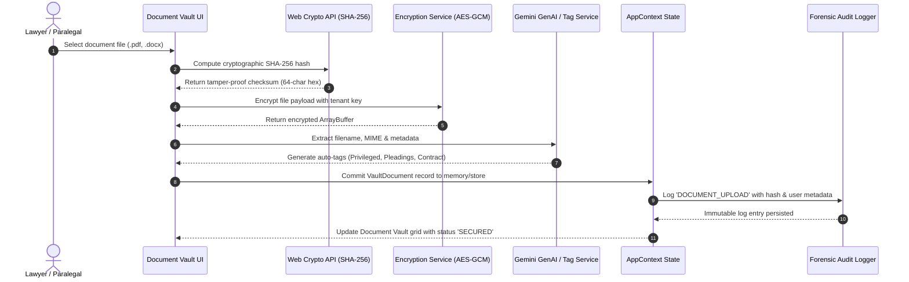
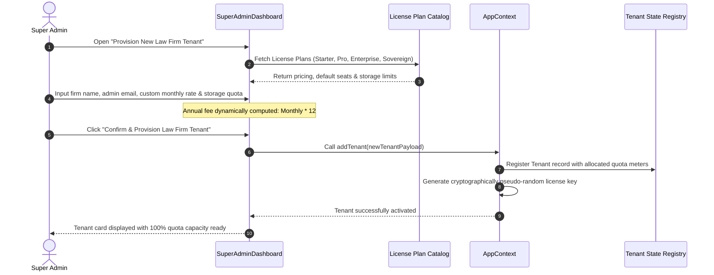
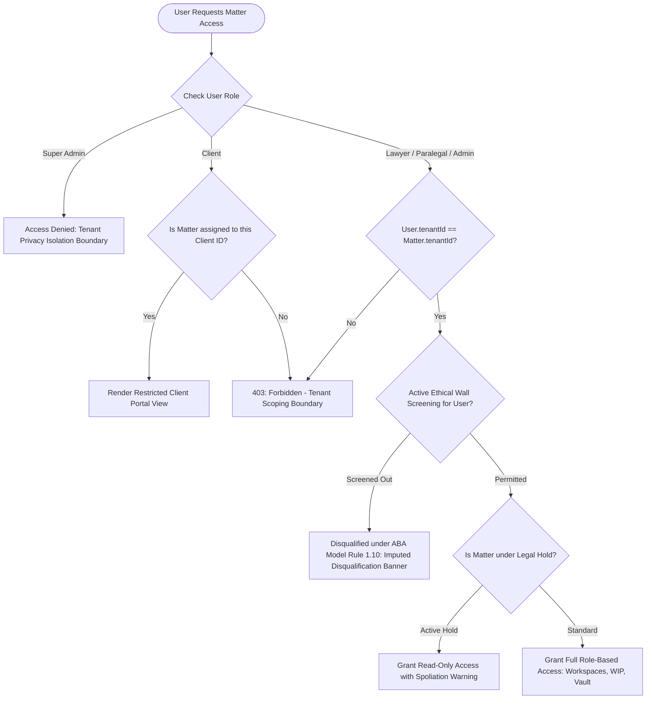
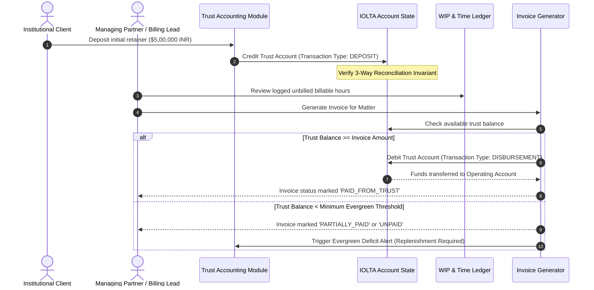
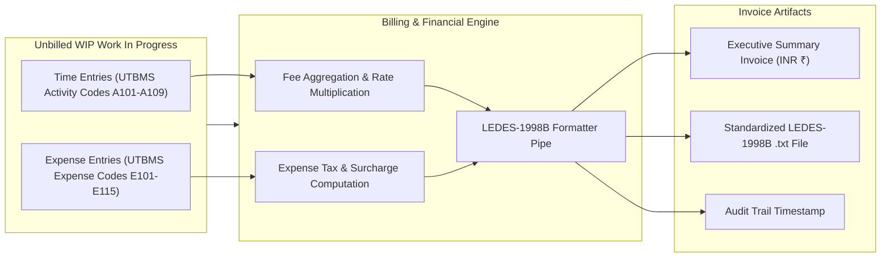

# Data Flow Diagrams

This document illustrates the flow of data through key business, security, and document management workflows within **Counsel Repos**.

---

## 1. Document Upload, Hashing & AI Tagging Pipeline

---

## 2. SaaS Tenant Onboarding & Quota Allocation Flow

---

## 3. Matter Access & Ethical Wall Screening Flow

---

## 4. Trust Accounting (IOLTA) & Retainer Replenishment

---

## 5. LEDES-1998B Invoicing Data Pipeline

