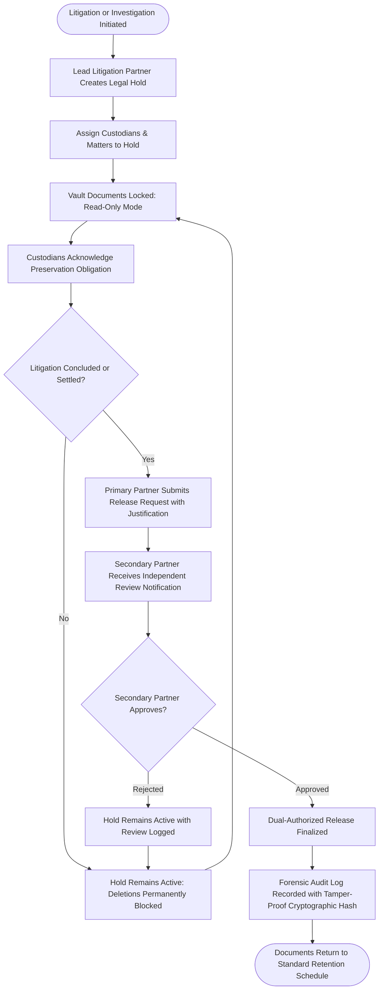
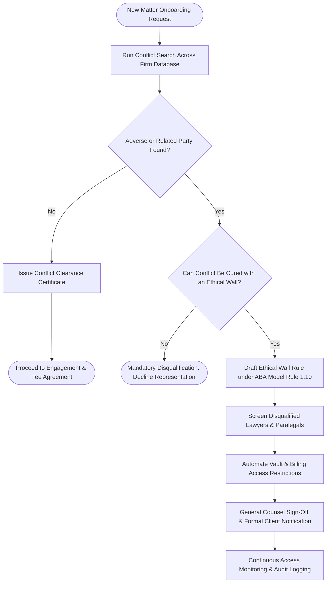
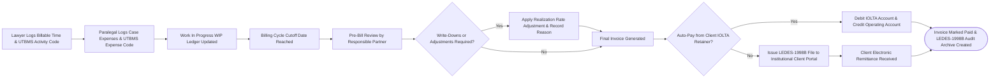
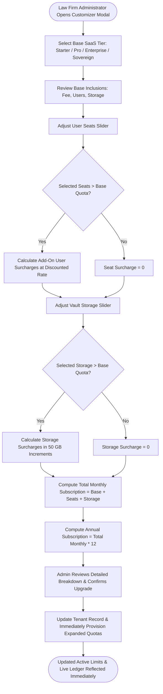

# Process Flow Diagrams

This document outlines the core business and compliance processes enforced across **Counsel Repos**.

---

## 1. Legal Hold Preservation & Two-Person Release Process

To comply with Federal Rule of Civil Procedure 37(e) and strict spoliation prevention standards, a legal hold can only be released through a mandatory **two-person authorization protocol**.

---

## 2. Conflict of Interest Check & Ethical Wall Enforcement

---

## 3. WIP Tracking to LEDES-1998B Invoicing Lifecycle

---

## 4. SaaS Subscription Customization & Quota Surcharges

